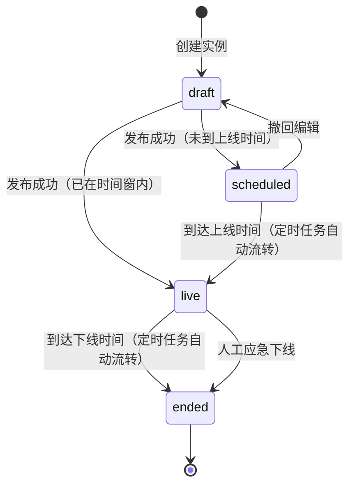
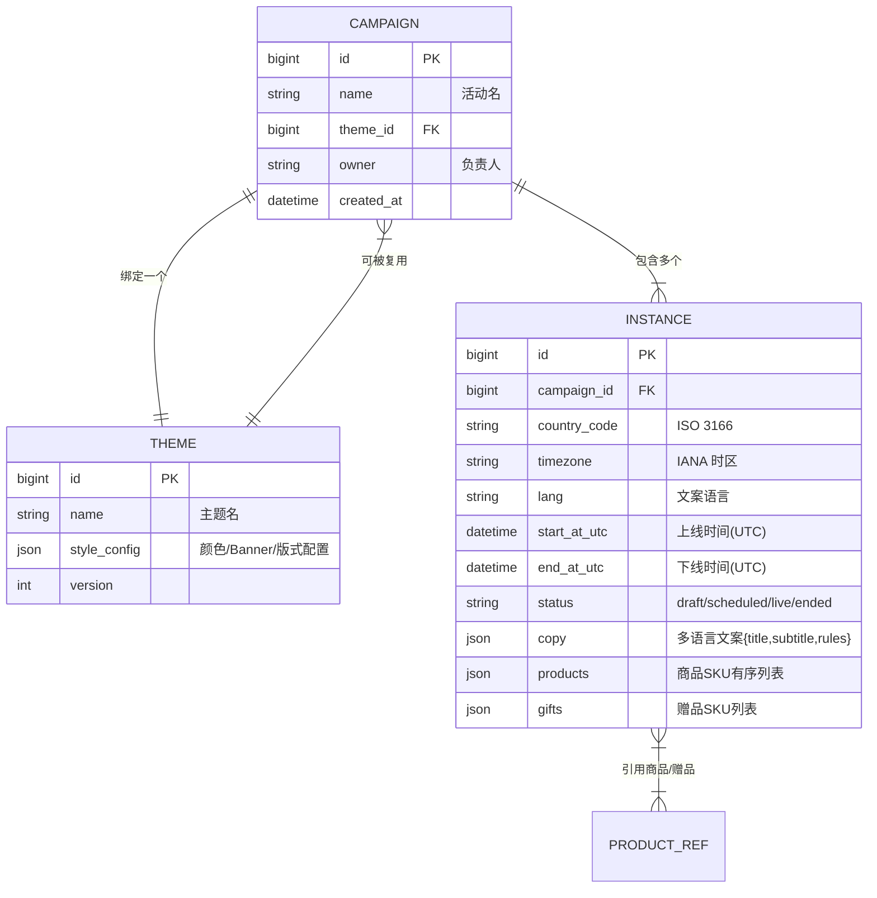

# Insta360 商城活动落地页管理后台 —— 产品需求文档（PRD）

> 版本：V1.0 ｜ 状态：评审中 ｜ 读者：交互/视觉设计、前后端研发、测试、运营
> 关联文档：《01-用户问题与产品定位说明》《03-评测与灰度方案》｜ 可交互 Demo：`demo/index.html`

---

## 1. 需求概述

建设活动落地页管理后台，支撑运营自助完成全球多国家/地区活动落地页的配置、预览与发布，核心能力：

1. 主题模板化，样式跨国家复用；
2. 分国家/地区独立排期，到点自动上线/下线；
3. 分国家/语言差异化配置商品、赠品、文案；
4. 提前配置 + PC/Mobile 内部预览，生效前 C 端不可访问；
5. 全链路防错校验，降低配置错误导致的线上问题。

**范围（In Scope）：** 活动管理、主题库、实例配置、排期与自动上下线、预览与访问隔离、防错校验、操作日志。
**范围外（Out of Scope）：** 可视化拖拽装修、商品/价格维护、C 端渲染引擎重构（详见定位文档边界章节）。

---

## 2. 核心领域模型：三层结构

本方案的核心抽象，所有功能围绕它展开：

```
活动 Campaign（一次大促，如 2026 Prime Day）
 └── 主题模板 Theme ×1（页面样式资产，如 Prime Day 蓝）
      └── 落地页实例 Instance ×N（国家/地区 × 语言 × 时间，如 UK / DE / ES）
```

| 层级 | 职责 | 解决的问题 |
| --- | --- | --- |
| **Campaign 活动** | 聚合一次营销活动的全部实例，承载活动名、负责人、备注 | 活动维度的管理单元 |
| **Theme 主题模板** | 颜色体系、Banner 样式、按钮/价格样式、模块版式等视觉资产 | 同一活动下所有国家复用同一样式（场景 1） |
| **Instance 实例** | 某国家/地区的一个具体落地页：上/下线时间、语言、商品、赠品、文案 | 分国家差异化内容与排期（场景 2、3） |

**关键规则：**
- 一个 Campaign 绑定一个 Theme；一个 Theme 可被多个 Campaign 复用（如每年 Black Friday 复用黑色主题迭代版）。
- 一个 Campaign 下，同一国家/地区 + 同一语言仅允许一个实例。
- C 端用户访问落地页 URL（如 `/campaign/prime-day-2026?country=uk`）时，路由层仅放行状态为「进行中」的实例，否则返回「活动未开始/已结束」页。

---

## 3. 角色与权限矩阵

| 功能 | 活动运营 | 运营主管 | 研发/管理员 | 只读成员 |
| --- | --- | --- | --- | --- |
| 查看活动/实例/主题 | ✅ | ✅ | ✅ | ✅ |
| 新建/编辑活动与实例 | ✅ | ✅ | ✅ | ❌ |
| 预览（PC/Mobile） | ✅ | ✅ | ✅ | ✅ |
| 提交发布 | ✅ | ✅ | ❌ | ❌ |
| 审核发布（V1.1） | ❌ | ✅ | ❌ | ❌ |
| 人工应急下线 | ❌ | ✅ | ✅ | ❌ |
| 主题库管理 | ❌ | ✅ | ✅ | ❌ |
| 查看操作日志 | ✅ | ✅ | ✅ | ❌ |

> V1.0 发布默认为「提交即发布（通过校验后）」，审核流为 V1.1 能力，本 PRD 状态机中预留「待审核」状态。

---

## 4. 功能需求详述

### 4.1 活动列表与看板（F1）

**目标：** 运营一屏掌握所有活动进展。

| 编号 | 需求 | 优先级 |
| --- | --- | --- |
| F1-1 | 活动卡片列表：活动名、主题色条、实例数（含各国状态汇总）、整体时间范围、活动状态徽章 | P0 |
| F1-2 | 状态筛选 Tab（全部/草稿/待上线/进行中/已结束）+ 关键词搜索 | P0 |
| F1-3 | 活动状态由其实例状态聚合：任一实例进行中 → 活动「进行中」；所有实例待上线 → 「待上线」；全部结束 → 「已结束」 | P0 |
| F1-4 | 「新建活动」入口，进入创建向导 | P0 |

### 4.2 创建/编辑向导（F2）—— 三步

**Step 1 选主题（F2-1）**
- 主题卡片矩阵展示主题库中可用主题，卡片直接渲染主题缩略效果（色板 + Banner 样式）；
- 选中主题即确定该活动全部实例的视觉样式，实例层不可修改样式（保证一致性，避免运营误改）。

**Step 2 配置国家/地区实例（F2-2）**
左侧为国家实例列表（可增删），右侧为选中实例的配置表单：

| 字段 | 说明 | 校验 |
| --- | --- | --- |
| 国家/地区 | 下拉选择，展示国旗与时区（如 英国 GMT+1） | 必填；同活动内不可重复 |
| 文案语言 | 下拉（英/德/西/法/日/中…），默认取该国官方语言 | 必填 |
| 上线时间 | datetime 选择器，**以该国本地时间录入**，界面常驻时区提示 | 必填；不得早于当前时间（编辑进行中实例除外） |
| 下线时间 | 同上 | 必填；必须晚于上线时间 |
| 活动商品 | 从商品中心选择器选择，展示缩略图/SKU/活动价；支持排序 | 至少 1 个；商品必须在该国有售且库存>0（选择时实时校验） |
| 赠品 | 选填，同商品选择器，标记「赠」 | 赠品在该国可赠 |
| 活动文案 | 标题、副标题、活动规则，**随所选语言填写**；切换语言 Tab 可对比 | 标题必填，长度上限校验 |

**Step 3 检查与发布（F2-3）**
- 发布前弹出**检查清单弹窗**，系统自动逐项检测并展示结果（通过✅ / 失败❌ 附原因与定位链接）：
  1. 所有实例时间逻辑合法（下线 > 上线）；
  2. 同国家实例时间无重叠冲突（与线上已存在活动）；
  3. 必填项完整（时间/语言/商品/标题）；
  4. 商品全部在售且有货；
  5. 至少完成一次 PC 与一次 Mobile 预览（系统记录预览行为）。
- 全部通过方可点击「确认发布」；任一项失败则发布按钮禁用，点击失败项可跳回对应实例表单。

### 4.3 分国家排期与自动上下线（F3）

**状态机（实例级）：**



| 编号 | 需求 | 优先级 |
| --- | --- | --- |
| F3-1 | 实例状态：draft 草稿 / scheduled 待上线 / live 进行中 / ended 已结束 | P0 |
| F3-2 | 定时任务每分钟扫描，到达 startAt 的 scheduled 实例自动转 live 并对 C 端放行；到达 endAt 的 live 实例自动转 ended 并下线 | P0 |
| F3-3 | 状态流转全部记录操作日志（含执行人=系统），流转失败即时告警（飞书/邮件通知负责人）并触发补偿任务 | P0 |
| F3-4 | 时间存储：录入为目标国家本地时间（带 IANA 时区标识），服务端统一转 UTC 存储，自动处理夏令时 | P0 |
| F3-5 | 编辑限制：live 实例仅允许修改文案与商品排序（改时间/换主题需先撤回为草稿或等结束后复制新实例），防止线上页面被中途改崩 | P0 |
| F3-6 | 人工应急下线：主管/管理员可将 live 实例强制转 ended，二次确认并强制填写原因 | P0 |

### 4.4 预览与访问隔离（F4）

| 编号 | 需求 | 优先级 |
| --- | --- | --- |
| F4-1 | 任意状态实例均可生成**内部预览链接**：URL 携带签名 token（如 `?preview_token=xxx`），有效期 24h，仅员工账号可访问 | P0 |
| F4-2 | 预览支持 PC / Mobile 两种视口一键切换，渲染与 C 端完全一致的页面（同一份渲染数据） | P0 |
| F4-3 | **C 端访问隔离**：不带有效 token 的访问，仅当实例状态为 live 时放行；scheduled/ended 实例分别返回「活动未开始」页（含上线倒计时）与「活动已结束」页 | P0 |
| F4-4 | 预览行为被系统记录（谁、何时、预览了哪个实例的哪个端），作为发布检查清单第 5 项的依据 | P0 |
| F4-5 | 预览页顶部常驻「预览模式」水印条，防止内部截图被误传为线上页面 | P0 |

### 4.5 防错校验体系（F5）—— 四道防线

| 防线 | 时机 | 规则 |
| --- | --- | --- |
| L1 表单即时校验 | 录入时 | 必填、时间逻辑（下线>上线）、字符长度、商品在售状态 |
| L2 实例间冲突检测 | 保存时 | 同国家/地区下与本活动或其他活动实例的时间窗重叠 → 警告并需确认（同主题复用场景允许排队衔接，重叠 ≤0 容忍） |
| L3 发布前检查清单 | 发布时 | 见 F2-3，五项全过才可发布 |
| L4 线上兜底 | 运行期 | 状态流转任务失败告警 + 人工应急下线开关 + 操作日志可追溯 |

### 4.6 操作日志（F6，P1）

- 记录实例粒度的创建/修改/发布/上下线/应急下线事件：操作人、时间、变更前后值；
- 支持按活动、按人、按时间筛选，保留 180 天。

---

## 5. 数据模型（核心实体）



**说明：**
- `products`/`gifts` 仅存 SKU 引用与排序，商品实时信息（图/价/库存）渲染时从商品中心读取，保证价格永远以商品中心为准，杜绝「落地页价格与商详不一致」类错误；
- Theme 带版本号，Campaign 记录绑定的主题版本，主题升级不影响已发布活动。

---

## 6. 核心接口草案（API）

| 接口 | 方法 | 说明 |
| --- | --- | --- |
| `/api/campaigns` | GET/POST | 活动列表（带状态/关键词过滤）/ 创建活动 |
| `/api/campaigns/{id}` | GET/PUT | 活动详情 / 更新（含实例批量保存） |
| `/api/themes` | GET | 主题库列表 |
| `/api/campaigns/{id}/instances` | POST/PUT/DELETE | 实例增改删（draft 状态） |
| `/api/instances/{id}/validate` | POST | 发布前检查清单，返回逐项结果 |
| `/api/instances/{id}/publish` | POST | 发布（前置校验全过才受理） |
| `/api/instances/{id}/preview-url` | POST | 生成带签名 token 的预览链接 |
| `/api/instances/{id}/force-offline` | POST | 应急下线（主管/管理员） |
| `/api/instances/{id}/logs` | GET | 操作日志 |
| `/c/{campaignSlug}` | GET（C端） | 用户访问入口：按 country 匹配实例，仅 live 放行，否则返回未开始/已结束页 |

**定时任务：** `instance-state-scheduler`，每分钟执行：
1. `scheduled` 且 `start_at_utc <= now` → 转 `live`；
2. `live` 且 `end_at_utc <= now` → 转 `ended`；
3. 任一流转失败 → 告警 + 补偿队列重试。

---

## 7. 非功能需求

| 类别 | 要求 |
| --- | --- |
| 时区 | 全部时间 UTC 存储 + IANA 时区库转换；夏令时自动适配；UI 全程展示当地时间与 UTC 对照 |
| 性能 | 活动列表页（100 活动量级）首屏 < 1.5s；C 端落地页路由判断 < 50ms（实例状态走缓存，状态流转时主动失效） |
| 可用性 | 上下线任务为关键链路，执行成功率监控目标 100%；C 端路由层降级策略：状态服务不可用时一律不放行（宁可不展示，不可错展示） |
| 兼容性 | 后台支持 Chrome/Edge 最近两个大版本；预览需覆盖 iOS/Android 主流视口 |
| 安全 | 预览 token 签名 + 24h 过期 + 员工 SSO 校验；后台操作全部鉴权与审计 |
| 数据一致性 | 活动-实例批量保存走事务，避免部分实例保存成功的中间态 |

---

## 8. 埋点需求（支撑评测方案）

| 事件 | 触发 | 关键参数 |
| --- | --- | --- |
| `campaign_create` | 创建活动 | campaign_id, theme_id |
| `instance_save` | 保存实例 | campaign_id, country, 耗时 |
| `preview_view` | 打开预览 | instance_id, device(pc/mobile) |
| `publish_attempt` | 点击发布 | campaign_id, 检查结果(各项通过与否) |
| `publish_success` | 发布成功 | campaign_id, 从创建到发布总耗时 |
| `state_auto_change` | 自动上下线流转 | instance_id, from, to, 是否准时 |
| `validation_block` | 校验拦截 | 规则类型, instance_id |
| `force_offline` | 应急下线 | instance_id, reason |

---

## 9. 验收标准（核心链路）

1. 创建 Black Friday 活动，选黑色主题，添加 UK（8.20 上线）/DE（8.25 上线）/ES 三个实例，配置不同语言文案与商品 → 保存成功；
2. 三个实例在发布前均可分别预览 PC/Mobile 效果，样式与主题一致、内容各自独立；
3. 不带 token 访问任一未上线实例 URL → 返回「活动未开始」页；到达 UK 上线时间后，UK 实例自动可访问，DE 仍不可访问；
4. 配置一个下线时间早于上线时间的实例 → 表单即时报错且无法保存；
5. 发布时若某实例未选商品 → 检查清单对应项失败，发布按钮禁用，点击可定位到该实例；
6. 到达 DE 下线时间后，DE 实例自动下线，用户访问返回「活动已结束」页；
7. 以上每一步在操作日志中可追溯。
